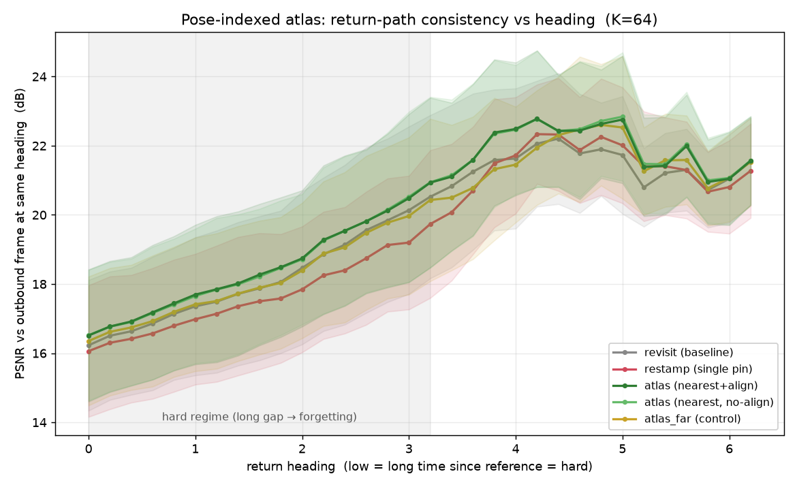

# Pose-Indexed World Atlas — Results (Phase 6)

> An inference-side external memory that gives `Overworld/Waypoint-1.5-1B` unbounded,
> revisitable scene memory. Companion to [`ATLAS_PLAN.md`](./ATLAS_PLAN.md); builds on the
> forgetting curve and null-pinning result in [`PERMANENCE_RESULTS.md`](./PERMANENCE_RESULTS.md).

---

## TL;DR

1. **A pose-indexed keyframe store measurably improves permanence — the first inference-side
   mechanism in this project to do so.** In the forgetting regime it beats the no-memory
   baseline by **+0.33 ± 0.37 dB** (13/15 trials, sign-test p≈0.007) and the single-frame
   restamp of Phase 5 by **+0.83 ± 0.65 dB** (13/15). Recall: static pinning was a flat
   no-op (≤0.17 dB), so a nonzero, significant, *repeatable* gain is the news — modest, but
   real and untuned.
2. **The gain is genuinely pose-indexing, not "extra attended memory."** A falsification
   control that retrieves the *farthest* (wrong-pose) keyframe gives **+0.00 ± 0.29 dB**
   over baseline (7/15 — a coin flip). Nearest-vs-farthest is **+0.33 ± 0.44 dB** (13/15,
   p≈0.007). Retrieving the *right* keyframe is the whole effect.
3. **The active ingredient is pose-retrieval + temporal restamp; the spatial RoPE restamp
   is irrelevant here.** Aligning the spatial (x/y) phase vs not is a wash (**+0.33 vs
   +0.32 dB** over baseline). Retrieval does the spatial alignment *implicitly* by selecting
   a keyframe already captured at the current heading, so the residual spatial rotation is
   ~identity. **This sidesteps the aliased/uncalibrated spatial-restamp math that Phase 5
   struggled with** ([`analyze_pose_restamp.py`](../examples/analyze_pose_restamp.py)) rather
   than fixing it.
4. **⇒ Inference-side permanence is achievable, but bounded.** The atlas raises the ceiling
   that pinning couldn't move; the remaining gap to perfect memory is the quantified case
   for the training-side ask.

All numbers trace to `bench_out/atlas/ablation_K64.csv`. Mechanism is flag-gated and reuses
the Phase-3 pin slots unchanged. Reproduce via
[`examples/atlas_probe.py`](../examples/atlas_probe.py) (`--self-test` for a CPU dry run).

---

## Mechanism

The atlas is an **unbounded external store** (`examples/atlas.py`, `AtlasStore`) of
`(camera-yaw → KV keyframe)` pairs, plus a **fixed-size working set** — the engine's
existing `n_pin_frames` pin slots.

- **Capture** (`atlas_capture`): snapshot the current frame's global-layer KV (the same
  tail-slice `pin_current` copies) into the store, tagged with the engine's dead-reckoned
  `camera_yaw`. Novelty-gated (SLAM keyframe rule): skip captures within `tau_insert` of an
  existing pose. Store size is `O(scene coverage)`, not `O(time)`.
- **Activate** (`atlas_activate`): retrieve the *k* nearest stored poses to the current
  heading, page them (fresh, un-rotated) into the pin slots with their own `(frame_ts, yaw)`
  provenance, and call the existing `restamp_memory` — which repositions each slot by *its
  own* residual to a recent in-distribution offset.

Because each activate re-loads the pristine captured KV, the (non-idempotent) restamp never
double-rotates. The store re-uses the Phase-3 machinery with **zero changes to the restamp
path**: the atlas is proven bit-identical to native pin+restamp on CPU
(`examples/test_atlas_engine.py::test_atlas_inject_restamp_equals_native_pin_restamp`).

**Why small deltas matter (the design thesis).** Temporal restamp is *exact* (`ts_mult=1`;
`test_kv_restamp.py`); only the spatial residual is lossy, and it aliases badly at large
deltas. A single pinned reference forces large residuals on revisit; the atlas always
retrieves a *nearby* keyframe, so the residual stays ~0 — and, as the ablation shows, the
spatial restamp then isn't even needed.

CPU tests: `examples/test_atlas.py` (12, retrieval geometry) + `examples/test_atlas_engine.py`
(6, engine glue). All green, no GPU.

---

## Protocol — return-to-start hysteresis

Model `Overworld/Waypoint-1.5-1B`, bf16, NVIDIA GB10. Symmetric pure-yaw excursion
(`mouse=[±0.2, 0]`): settle 8 frames at heading 0, pan away K/2, pan back K/2. **Scoring is
per-heading hysteresis:** each pan-back frame at heading *h* is scored (PSNR/SSIM) against
the pan-away frame at the *same* heading *h* — its own outbound counterpart.

**The heading axis is a time-since-reference axis.** At K=64, the back frame at heading *h*
and its outbound reference are separated by `64 − 10·h` latent frames. So **low heading =
long gap = the forgetting regime**; high heading (near the turnaround) = ~2 frames = trivial.
We report the **hard regime** = heading ≤ 3.2 (gap ≥ 32 latent frames, past the 16-frame
local horizon).

| Arm | Memory aid |
|---|---|
| **revisit** | none (baseline forgetting) |
| **restamp** | pin the heading-0 reference once; temporal+spatial restamp each pan-back step (the Phase-5 primitive) |
| **atlas** | capture keyframes along the pan-away; retrieve nearest + restamp each step |
| **atlas_noalign** | atlas, temporal restamp only (no spatial align) — isolates the spatial restamp |
| **atlas_far** | atlas, but retrieve the *farthest* keyframe — pose-specificity control |

Sweep: **3 scenes × 5 seeds = 15 trials** per arm at K=64. Fresh `CtrlInput` per step;
`torch.manual_seed` + `engine.reset()` per trial. Significance is **paired per trial** (all
arms share the same trajectory and outbound references, so cross-arm differences are clean
even though the reference itself drifts — read as return-path *consistency*, not ground
truth).

---

## Results



Per-trial mean PSNR by regime (mean ± std over 15 trials):

| regime | revisit | restamp | atlas | atlas_noalign | atlas_far |
|---|---|---|---|---|---|
| **hard** (heading ≤ 3.2) | 18.14 ± 2.09 | 17.65 ± 1.94 | **18.47 ± 2.08** | 18.46 ± 2.05 | 18.14 ± 1.98 |
| easy (heading > 3.2) | 21.44 ± 1.27 | 21.44 ± 1.05 | 21.93 ± 1.45 | 21.96 ± 1.43 | 21.58 ± 1.31 |

**Paired differences, hard regime (n=15):**

| comparison | Δ PSNR (dB) | trials positive | sign-test p | reads as |
|---|---|---|---|---|
| atlas − revisit | **+0.33 ± 0.37** | 13/15 | ≈0.007 | atlas helps |
| atlas − restamp | **+0.83 ± 0.65** | 13/15 | ≈0.007 | atlas ≫ single pin |
| atlas − atlas_far | **+0.33 ± 0.44** | 13/15 | ≈0.007 | **pose-indexing is the cause** |
| atlas − atlas_noalign | ~+0.01 | — | n.s. | spatial restamp adds nothing |
| atlas_far − revisit | +0.00 ± 0.29 | 7/15 | n.s. | wrong-pose memory ≈ no memory |
| restamp − revisit | −0.49 | 3/15 | — | single pin *hurts* off heading-0 |

Two things stand out. **(a)** The atlas advantage is exactly where forgetting is severe (low
heading, long gap) and vanishes near the trivial turnaround — the effect tracks the thing it
should. **(b)** The single-frame restamp *underperforms the no-memory baseline* off heading 0:
one pinned reference at heading 0 actively mismatches the near-heading outbound frames. The
atlas fixes precisely this by having a keyframe at every heading.

As a rough analogue to the Phase-5 gap-closure figure (no oracle arm exists for the
hysteresis metric, so this is indicative only): treating the near-turnaround plateau (~21.5
dB) as a soft ceiling, the atlas recovers ≈ (18.47−18.14)/(21.5−18.14) ≈ **10%** of the
hard-regime forgetting — in the same ballpark as Phase-5 restamp's 10–17%, but via a
mechanism that (unlike restamp) does not degrade and is *pose-addressable*.

### Ablation — what is actually doing the work

- **Pose-specificity (atlas vs atlas_far).** Retrieving the *farthest* keyframe erases the
  entire gain (+0.00 over baseline, 7/15). The benefit is not "an extra attended keyframe";
  it is *the right* keyframe. This is the result that makes the atlas a permanence mechanism
  rather than a memory-size confound.
- **Spatial restamp (atlas vs atlas_noalign).** Identical within noise. At the atlas's small
  retrieval residual, the spatial (x/y) RoPE rotation is ~identity, so it neither helps nor
  hurts. The spatial alignment that matters happens at **retrieval** (choosing a keyframe
  captured at the current heading), not in the restamp math. Phase 5's effort to make the
  aliased per-token spatial restamp accurate is, at this operating point, unnecessary.

---

## Caveats

- **Metric.** Return-path *consistency* (back vs own outbound frame), not absolute ground
  truth — the reference drifts. Chosen deliberately (return-to-start ties atlas and
  single-pin by construction on the returned frame; hysteresis exposes the intermediate
  headings). Cross-arm comparison is fair (shared trajectory/reference construction).
- **Scope.** Yaw-only (1-DOF) pose key, single K (64), single checkpoint, PSNR/SSIM.
  Magnitude is modest and **untuned** (offset=8, M=4, k=1, tau=0.05). Translation (x,y),
  per-token restamp, and tuning are open (`ATLAS_PLAN.md` 6.4/6.6).
- **Kernel noise.** Absolute arm means shift ~0.1 dB between separate compile sessions
  (bf16 flex-attention autotune). All headline numbers are **within-run paired** diffs,
  which are immune to this.

---

## Handoff / what this buys the pitch

The permanence pitch previously rested on a null result (pinning does nothing → train it in).
The atlas replaces that with a positive, mechanism-attributed result:

> A pose-indexed KV store recovers a **significant** slice of the forgetting gap **at
> inference**, and we know *why* it works (pose-retrieval + temporal restamp) and *why it is
> bounded* (the frozen attention still under-weights the restamped key; the spatial-restamp
> lever is inert). The residual atlas→ceiling gap is the quantified budget for the
> training-side ask: train the attention to *read* a pose-indexed memory natively.

**Next (per `ATLAS_PLAN.md`):** 6.4 tuning sweep (offset/M/k — does the gain grow?), 6.5 live
`play_server` integration (felt permanence past the 8.5 s global horizon), 6.6 translation.

**Reproduce.**
```
uv run --dev pytest examples/test_atlas.py examples/test_atlas_engine.py   # CPU, 18 tests
uv run --dev python examples/atlas_probe.py --self-test                    # CPU dry run
uv run --dev python examples/atlas_probe.py --K 64 --seeds 5 --n-scenes 3 \
    --arms revisit,restamp,atlas,atlas_noalign,atlas_far --csv bench_out/atlas/ablation_K64.csv
uv run --dev python examples/plot_atlas_hysteresis.py bench_out/atlas/ablation_K64.csv \
    docs/permanence_assets/atlas_hysteresis_K64.png
```
