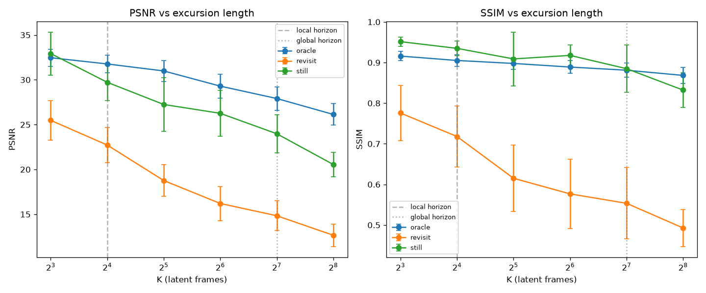
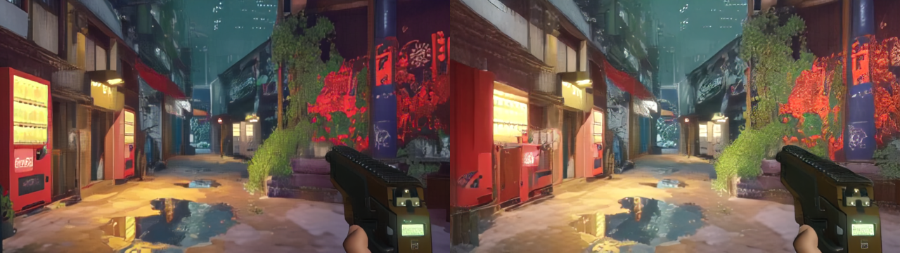
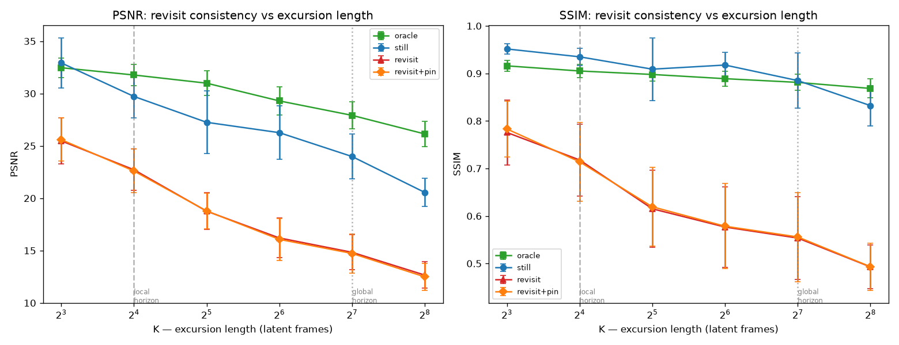

# Object/Scene Permanence in Waypoint-1.5 — Results

> Measured evidence of scene-forgetting in the `Overworld/Waypoint-1.5-1B` world
> model's KV ring-buffer, plus an inference-side mitigation (KV frame pinning).
> Companion to [`PERMANENCE_PLAN.md`](./PERMANENCE_PLAN.md).

---

## TL;DR

1. **Waypoint-1.5 forgets scenes it panned away from.** Revisiting a view after a
   camera excursion costs **7–10 dB PSNR / 0.18–0.34 SSIM** vs. holding the camera
   still — ~5× the sampling floor, robust across 3 scenes × 5 seeds. It keeps the gist
   and hallucinates the detail. *(Phase 2)*
2. **The cause is the KV ring buffer, baked into the weights.** Forgetting tracks the
   cache horizons: a knee at the **16-frame local horizon** (18/24 layers) and a
   **128-frame global horizon** (6 dilated layers). The plan's global horizon estimate
   was 8× too high — corrected here. *(Phase 1)*
3. **Inference-side frame-pinning does not help.** Re-inserting the evicted frame's
   keys so they survive and stay attendable moves revisit quality by **≤ 0.17 dB /
   0.007 SSIM (nothing)** — the pretrained attention can't use keys at out-of-
   distribution RoPE positions. *(Phase 3)*
4. **⇒ Permanence must be trained in, not patched at inference.** The forgetting curve
   and the null pinning result are the evidence base for a training-side proposal
   (persistent keyframes / learned scene memory). *(Phase 4)*

Bonus: the benchmark's oracle arm surfaced a real bug — `engine.get_state`/`load_state`
silently omitted the TAEHV streaming-decoder state; fixed + tested.

All numbers trace to `bench_out/*/results.csv`; every stage is flag-gated and
default-off. Reproduce via `examples/permanence_bench.py` (see file header).

---

## Phase 1 — Memory horizons (config-derived + empirically verified)

Config: `Overworld/Waypoint-1.5-1B` (`config.yaml`, loaded without weights).

| Parameter | Value |
|---|---|
| `n_layers` | 24 |
| `height × width` (latent patch grid) | 16 × 32 |
| `tokens_per_frame` (`height·width`) | 512 |
| `patch` | [2, 2] |
| `channels` | 32 |
| `local_window` | 16 latent frames |
| `global_window` | 128 |
| `global_pinned_dilation` | 8 |
| `global_attn_period` / `global_attn_offset` | 4 / −1 |
| `temporal_compression` | 4 RGB frames per latent frame |
| `inference_fps` (RGB) / `base_fps` (latent) | 60 / 15 |
| **latent-frame rate** | 15 Hz → **1 latent frame = 4/60 s ≈ 0.0667 s** |

**Global layers:** indices `[3, 7, 11, 15, 19, 23]` — 6 of 24 (every 4th, offset −1 ≡ 3).
The other 18 are local layers.

### Memory horizons

| Layer type | # layers | Frames retained | Spacing | **Horizon (latent)** | **Horizon (RGB)** | **Horizon (seconds)** |
|---|---|---|---|---|---|---|
| **Local** | 18 | 16 (consecutive) | every frame | **16** | 64 | **≈ 1.07 s** |
| **Global** | 6 | 16 (dilated) | every 8th frame | **128** | 512 | **≈ 8.53 s** |

### ⚠️ Correction to the plan's global-horizon formula

The plan estimated the global horizon as `global_window × global_pinned_dilation
= 128 × 8 = 1024` latent frames. **That is 8× too large.** Reading
`src/model/kv_cache.py:71`, the global ring uses

```
num_buckets = (L // tokens_per_frame) // pinned_dilation = 128 // 8 = 16
```

so it retains only **16 distinct frames**, written every 8th step (`write_step =
frame_idx % dilation == 0`). Those 16 keyframes span `16 × 8 = 128` latent frames.
**Dilation sets temporal *resolution* (1-in-8 sampling), not horizon *length*.**
The horizon equals `global_window` latent frames = 128.

Verified empirically by tracing the real `LayerKVCache` on CPU (feed frames
`0…399`, read back which frame indices survive in the ring) —
`scratchpad/kv_horizon_probe.py`:

- global (window=128, dilation=8): 16 frames retained, spacing 8, oldest = 127 back → **horizon 128** ✓
- local (window=16, dilation=1): 16 frames retained, spacing 1, oldest = 15 back → **horizon 16** ✓
- dense control (window=128, dilation=1): 128 frames retained, horizon 127 ✓

Side note: because `L = global_window × tpf` but only `num_buckets × tpf = 16 × 512`
slots are ever written, **7/8 of each global layer's KV buffer is allocated but
masked out** (correctness is preserved by the `written` mask; it's wasted VRAM).

### K-sweep (chosen from the corrected horizons)

K = length of the revisit excursion, in **latent frames**. Chosen to straddle both
horizons (local at 16, global at 128):

| K (latent) | 8 | 16 | 32 | 64 | 128 | 256 |
|---|---|---|---|---|---|---|
| seconds | 0.53 | 1.07 | 2.13 | 4.27 | 8.53 | 17.07 |
| vs. horizons | ½ local | **= local** | 2× local | ½ global | **= global** | 2× global |

Max revisit trial ≈ 256 latent frames (~17 s of generation) — ~8× cheaper than the
plan's 2048-frame worst case.

---

## Phase 2 — Revisit-consistency benchmark

Harness: `examples/permanence_bench.py` (arms still/revisit/oracle, PSNR+SSIM,
incremental CSV, A|B contact sheets, `--self-test` CPU dry-run). Model:
`Overworld/Waypoint-1.5-1B`, bf16, NVIDIA GB10. First `gen_frame` compiles
(max_autotune + cudagraphs). Autotune confirmed the Phase-1 KV shapes: local layers
KV length 8704 (16·512 + 512 tail), global layers 66048 (128·512 + 512 tail).

### 2a — Camera-return pilot (gate: PASSED)

Trajectory: **pure yaw**, `mouse=[±0.2, 0]`, K/2 right then K/2 left, after an
8-frame settle. Pilot at K=12 (excursion within the local horizon), 1 scene:

| Comparison | PSNR | SSIM | expectation |
|---|---|---|---|
| A vs away (furthest pan) | 16.00 | 0.573 | LOW — view moved ✓ |
| A vs B (returned) | 22.48 | 0.697 | HIGH — view returned ✓ |

Verified visually (`bench_out/pilot/…_A_away_B.png`): the middle frame is a clean
rightward yaw; the returned frame matches the reference (same vending machine, wall,
puddle, HUD weapon). **The mirrored-yaw trajectory returns the camera** → the sweep
uses `--trajectory yaw`. (Strafe fallback `--trajectory strafe` remains available.)

### 2b — Three-arm protocol

Per (scene, seed, K), after an 8-frame settle whose last decoded RGB frame is the
**reference view A**:

| Arm | Trajectory | Scored frame B | Isolates |
|---|---|---|---|
| **still** | K no-op frames (camera static) | frame at step K | autoregressive drift only (memory always intact — the view never leaves) |
| **revisit** | pan-away K/2 → pan-back K/2 | returned frame | drift **+ forgetting** |
| **oracle** | `get_state` → run revisit → `load_state` → 1 frame | 1 frame from restored state | sampling-noise floor (perfect memory) |

Metrics: **PSNR** + **SSIM** (luma, 11×11 Gaussian) on (A, B). Each trial reset +
reseeded (`torch.manual_seed`); fresh `CtrlInput` per step. Sweep: **3 scenes × 5
seeds × 6 K × 3 arms = 270 trials**, all completed, 0 errors. Every row in
`bench_out/sweep/results.csv`.

### 2c–2d — The forgetting curve

Mean ± std over 3 scenes × 5 seeds (15 trials per cell):

**PSNR (dB)**

| K | still | revisit | **revisit − still** |
|---|---|---|---|
| 8 | 32.93 ± 2.40 | 25.48 ± 2.21 | −7.45 |
| 16 *(= local horizon)* | 29.72 ± 2.05 | 22.72 ± 1.97 | −7.00 |
| 32 | 27.25 ± 3.00 | 18.76 ± 1.77 | −8.49 |
| 64 | 26.26 ± 2.56 | 16.21 ± 1.90 | **−10.05** |
| 128 *(= global horizon)* | 23.98 ± 2.13 | 14.84 ± 1.67 | −9.15 |
| 256 | 20.55 ± 1.36 | 12.66 ± 1.26 | −7.89 |

**SSIM**

| K | still | revisit | **revisit − still** |
|---|---|---|---|
| 8 | 0.952 | 0.776 | −0.176 |
| 16 | 0.935 | 0.718 | −0.217 |
| 32 | 0.909 | 0.615 | −0.294 |
| 64 | 0.918 | 0.577 | **−0.341** |
| 128 | 0.885 | 0.554 | −0.331 |
| 256 | 0.832 | 0.493 | −0.339 |



**Headline:** panning away and returning costs **7–10 dB PSNR / 0.18–0.34 SSIM**
relative to holding the camera still, and the gap **grows as the excursion crosses
the 16-frame local horizon**, peaking at **K = 32–64** (2–4× local horizon) — exactly
where the 18 local layers have evicted the reference view and only the 6 dilated
global layers remain. Past the global horizon (K ≥ 128) the *still* arm itself starts
drifting (static-scene autoregressive decay), so the gap narrows even as both arms
degrade. The scene is **forgotten**, not merely noised: the effect is ~5× the
sampling/oracle floor and far outside the seed-to-seed std.

**Qualitative** (`docs/permanence_assets/example_revisit_K64_A_vs_B.png`, A | returned-B
at K=64): the returned view is recognizably the same alley (vending machine, red
pillar, puddle, HUD weapon) but the **specifics have hallucinated** — the vending
machine has shifted and recolored, geometry has drifted. The model keeps the *gist*
and loses the *detail*, the signature of ring-buffer eviction.



**Caveats.**
- *Camera-return approximation*: mirrored yaw returns the heading only approximately,
  contributing a roughly K-independent offset (already ~7 dB at K=8, within the local
  horizon). The **forgetting-specific** signal is the *growth* of the gap with K.
- *Metrics*: PSNR punishes sub-pixel view offsets; SSIM + the contact sheets guard the
  interpretation. LPIPS optional (not installed here).
- *Oracle*: the oracle numbers in `bench_out/sweep` are **contaminated** — they were
  produced before the `get_state`/`load_state` VAE-state fix (see below), so they drift
  with K instead of being a flat floor. A clean oracle re-run replaces them below.
- Single model / single checkpoint.

### Engine fix surfaced by the oracle arm

The oracle arm exposed a real bug: `WorldEngine.get_state()` claimed to capture the
world state but omitted the **TAEHV streaming decoder/encoder temporal buffers**, so
`load_state` left them at their post-excursion values — a restored state kept decoding
frames from the pre-snapshot stream. Fixed in `src/ae.py` + `src/world_engine.py`
(deep-clone of the 7 `StreamingTAEHV.reset()` state fields; backward-compatible with
older snapshots). Regression tests in `examples/test_ae_state.py`.

## Phase 3 — KV frame-pinning (inference-side mitigation)

**Design.** `LayerKVCache` gains optional dedicated pin slots — layout
`[ring | pins | tail]` — written only by an explicit `pin_current()` and exempt from
ring eviction. `WorldEngine.pin_frame()` copies the current frame's **post-RoPE** KV
(variant (a): keys keep their original absolute temporal phase) into pin slots on the
**global layers only** (where long-horizon attention was trained). Flag-gated via
`model_config_overrides={"n_pin_frames": N}`; `N=0` (default) is the exact original
cache. The Phase-2 harness pins view A right after settle (`--pin-at-reference`).

**Sanity gates (full model).**
- *Determinism* — P=0 vs P=0 rerun: `max|Δlatent| = 0`, `max|ΔRGB| = 0` (bit-identical;
  cudagraphs are deterministic → the whole benchmark is reproducible).
- *Inertness* — P=0 vs `n_pin_frames=4` with no `pin_frame()`: `max|Δlatent| = 4.1e-2`.
  Not bit-identical, but this is **kernel-autotune noise from the larger KV buffer**
  (global capacity 66048 → 68096 selects a different flex_attention kernel), *not* a
  masking error: the CPU test proves P=4-no-pin has bit-identical *attended* KV + block
  mask to P=0 (`examples/test_kv_pinning.py::test_unpinned_output_matches_baseline`), so
  on identical inputs the residual is pure bf16 kernel rounding. Negligible vs the
  7–10 dB forgetting effect.
- *Mechanism verified* — on the real model, `pin_frame()` writes the reference frame's
  KV into the global-layer pin slots (`written` 0 → 512, `pin0 == tail`), it **survives
  a 64-frame excursion unchanged** (persists past ring eviction), and the no-pin control
  keeps the pin region empty. So pinned keys are genuinely present and attendable.

**Result — pinning is a no-op.** `revisit+pin` tracks `revisit` to within seed noise at
every K:

| K | revisit PSNR | revisit+pin PSNR | **pin − revisit** | revisit SSIM | pin SSIM | **Δ** |
|---|---|---|---|---|---|---|
| 8 | 25.48 | 25.59 | +0.12 | 0.776 | 0.783 | +0.007 |
| 16 | 22.72 | 22.60 | −0.12 | 0.718 | 0.714 | −0.004 |
| 32 | 18.76 | 18.79 | +0.02 | 0.615 | 0.619 | +0.004 |
| 64 | 16.21 | 16.07 | −0.14 | 0.577 | 0.578 | +0.002 |
| 128 | 14.84 | 14.73 | −0.11 | 0.554 | 0.556 | +0.002 |
| 256 | 12.66 | 12.49 | −0.17 | 0.493 | 0.493 | +0.000 |



The pinned-revisit curve lies **exactly on top of** baseline revisit.

**Interpretation.** The pinned keys survive eviction and are attended — but the
pretrained model does not *use* them. The most likely cause is the RoPE constraint
(`src/model/attn.py:108`): keys are cached **post-RoPE** carrying the absolute temporal
phase of their original `t_pos`. When queried K frames later, the query–key relative
distance far exceeds the trained global horizon (128 latent frames) — a temporal
position the attention never learned to score, so the pinned key's QK logit is
effectively negligible and it contributes ~nothing. **Making a forgotten frame
*available* is not the same as making the model *use* it.** This is the plan's
anticipated variant-(a) failure mode, measured rather than assumed.

## Phase 4 — Pitch: permanence needs a training-side fix

**The one-page argument.**

1. **Scenes are forgotten, measurably.** Panning away and back costs **7–10 dB PSNR /
   0.18–0.34 SSIM** vs. a static camera (Phase 2), ~5× the sampling floor, robust across
   3 scenes × 5 seeds. The returned view keeps the *gist* and hallucinates the *detail*.
2. **The cause is architectural, not stochastic.** Forgetting tracks the KV ring-buffer
   horizons exactly: the knee is at the **16-frame local horizon** (18 of 24 layers),
   and only the 6 dilated global layers (128-frame horizon, 16 keyframes) carry anything
   further. This layout is **baked into the pretrained weights**.
3. **Inference-side pinning does not fix it.** Re-inserting the evicted frame's keys so
   they survive and remain attendable changes revisit quality by **≤ 0.17 dB / 0.007
   SSIM — nothing** (Phase 3). The weights can't leverage persistent memory they were
   never trained to use; the post-RoPE keys sit at out-of-distribution temporal
   distances the attention can't score.
4. **Therefore the fix must be trained in.** The evidence says permanence is not a
   band-aid you can bolt onto Waypoint-1.5 at inference — it is a property the
   architecture has to learn.

**Concrete asks (in increasing scope):**
- **(b) Position re-stamping** *(inference, medium)* — cache pinned keys **pre-RoPE** and
  re-rotate them at read time to an in-distribution relative position. This directly
  tests whether variant (a)'s null is *only* the OOD-position problem. Bigger change
  (touches the attention read path); the harness's `--pin-at-reference` already provides
  the evaluation.
- **Training with persistent keyframes** *(training repo, the big win)* — train Waypoint
  with randomly-pinned distant keyframes / a learned scene-memory slot so the attention
  natively learns to attend across the ring boundary. Phases 2–3 are the evidence base:
  forgetting is large and cannot be patched post-hoc.

**Reproduce:** `uv run --dev python examples/permanence_bench.py --self-test` (CPU dry
run); full sweep + pinning via `--arms … --pin-at-reference` (see file header). Curves
regenerate with `examples/combine_curves.py`. Pin mechanism: `examples/test_kv_pinning.py`.
